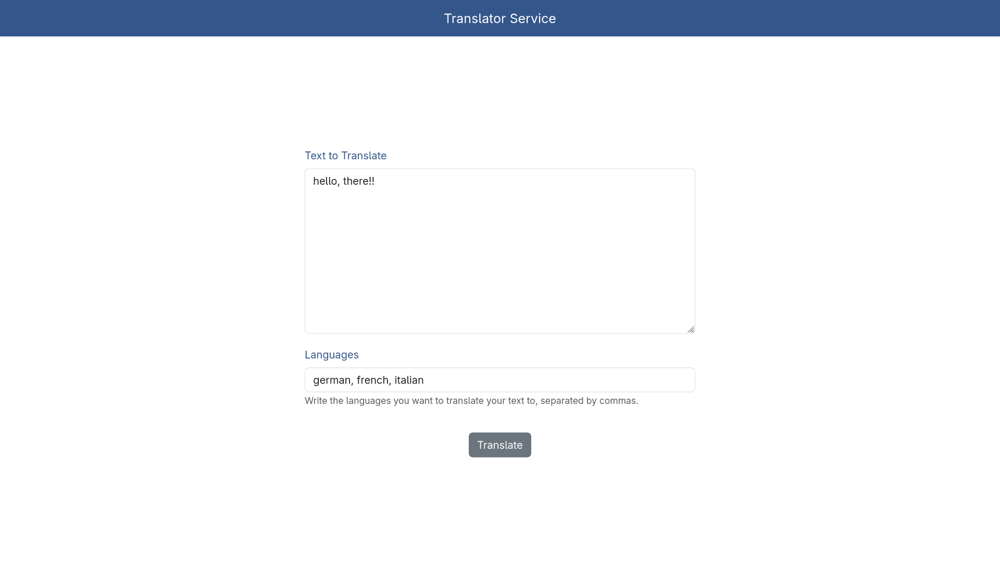
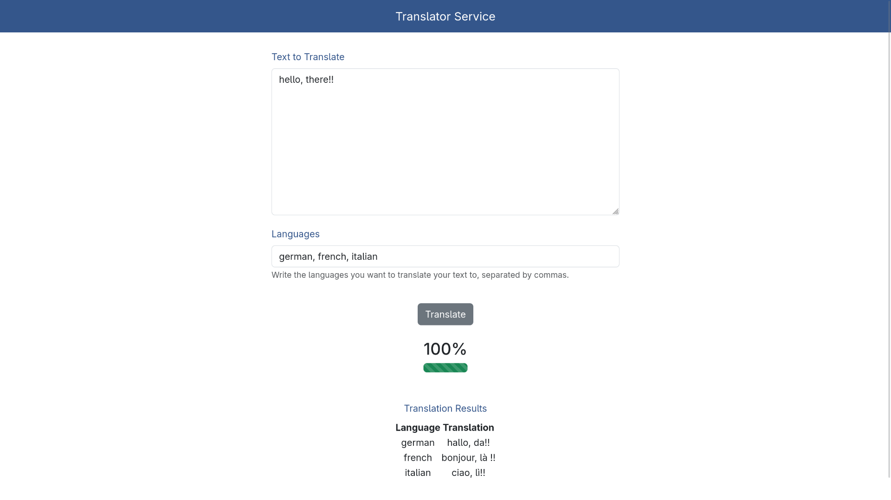

# Translation Service Application

### Full stack, AI-APP

### Uses the hugging face inference api to call model, and translate needed text

### libs/modules used - 
`
fastapi[standard]
uvicorn
sqlalchemy
jinja2
huggingface_hub
psycopg2-binary
`
### How to Run?
make sure u r in the app folder and hit,
`uvicorn main:app --reload`

### Note
Make sure,  
1. Have the proper PGsql url, in the .env file.
2. Have a hugging face inference API-token.

#### Some screenshots!

